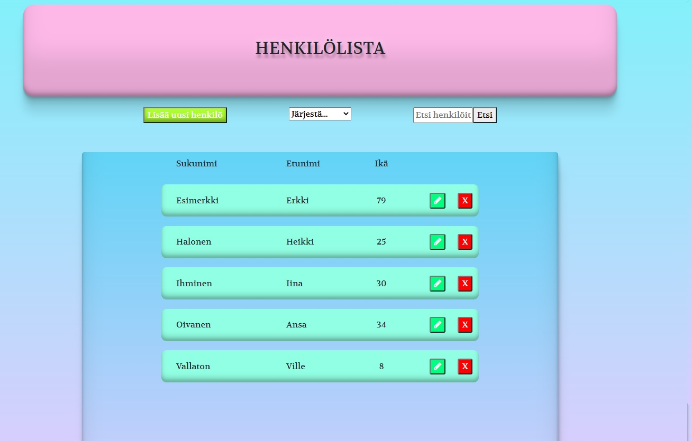
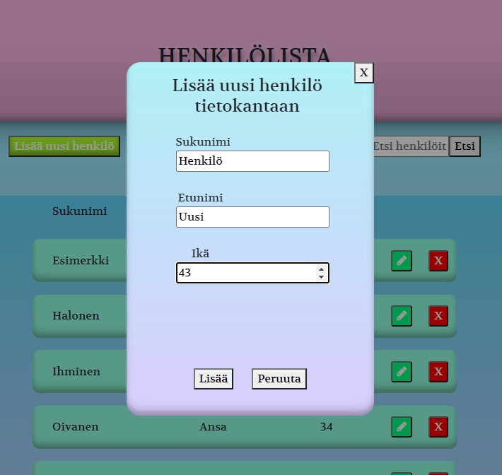
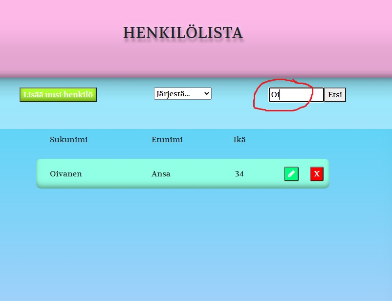

# Netum ennakkotehtävä kesätöitä varten

T 2.3 Fullstack-sovellus

Pyörimässä herokussa: https://summer-job-preassignment-netum.herokuapp.com/

Kyseessä on siis fullstack sovellus, jossa on käytetty Node.js & Typescriptiä backendissa
(sekä Mysql tietokantaa) ja React & Typescript komboa frontendissa. 
Sovelluksesta löytyy ominaisuudet lisätä, poistaa sekä muokata listalla olevia henkilöitä. Henkilöitä pystyy
myös järjestämään sukunimen, etunimen sekä iän mukaan.
Sovelluksessa on myös frontendiin toteutettu hakuominaisuus joka toimii reaaliajassa, eli kun käyttäjä kirjoittaa
hakukenttään, listaa aletaan filtteröimään hakuehtojen mukaisesti.

